# PicoCrystal

A Game Boy Color emulator for the [Pimoroni PicoSystem](https://shop.pimoroni.com/products/picosystem)
(RP2040 handheld), built around a heavily optimized fork of
[Walnut-GB/CGB](host_test/LICENSE-walnut-cgb). Drop your ROMs in `assets/`,
run `make`, copy one `.uf2` to the device, and pick a game from the boot menu.

<p align="center">
  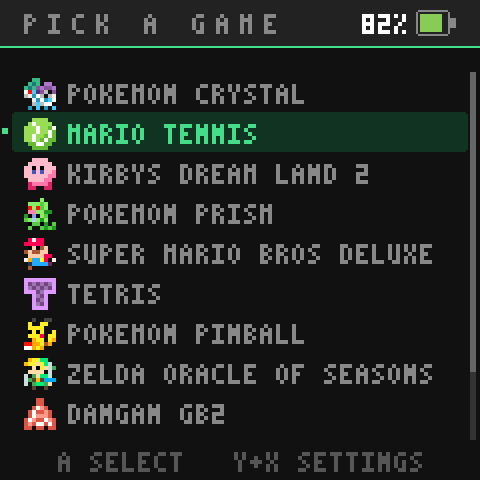
  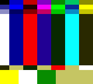
  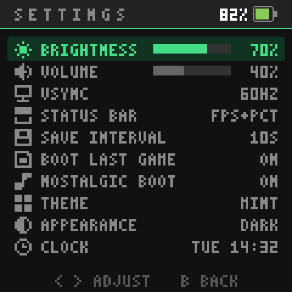
</p>

- Full-speed CGB emulation on the RP2040's two Cortex-M0+ cores
  (overclocked to 250MHz), with optional tear-free vsync
- Boot menu for multiple ROMs; per-game flash save regions
- Automatic battery-backed-save persistence: autosaves to flash a few
  seconds after the game writes cart RAM, double-buffered so a mid-save
  power-off can never destroy the last good save. The interval is
  configurable (3s–120s, to limit flash wear on games that write cart RAM
  constantly), or set it to MANUAL and save on demand with **X+B**
- MBC3 real-time clock, persisted across power cycles (freeze-while-off,
  adjustable in the settings menu)
- COLOR FILTER picture modes: GBC approximates a real GBC screen's channel
  bleed instead of showing raw palette values (softer, less saturated colors,
  lifted a little to suit this panel), plus VIVID, PASTEL, MONO, SEPIA, NIGHT,
  GB GREEN and POCKET (the two classic four-shade DMG palettes) and INVERT.
  Every mode is baked into the palette lookup, so none of them costs a frame
- Settings menu (Y+X): brightness, volume, vsync, color filter,
  FPS/battery overlays, save interval, clock

**No ROMs are included** and none can be distributed with this repository.
Use your own cartridge dumps or freely licensed homebrew.

## Building

Requirements: `cmake` (≥ 3.12), `gcc-arm-none-eabi` (+ newlib), `python3`,
and `make`. The [pico-sdk](https://github.com/raspberrypi/pico-sdk) is fetched
from git automatically on the first configure; to use an existing checkout,
set `PICO_SDK_PATH` in your environment.

```sh
cp path/to/your/roms/*.gbc assets/
make
```

> **Setting names, order, and save slots:** before building, optionally create
> `assets/roms.json` to rename games, fix their menu order, and pin save slots.
> This matters especially if you have saves you want to keep — see
> [Customizing names, order, and save slots](#customizing-names-order-and-save-slots-assetsromsjson)
> below. An `assets/icons.png` sheet gives each game its own boot-menu icon —
> see [Per-game menu art](#per-game-menu-art-assetsiconspng).

Every `.gb`/`.gbc` file in `assets/` is validated (header checksum, supported
mapper, cart-RAM size) and embedded into the firmware; the build fails with a
readable message if a file isn't a usable ROM or the set won't fit in the
16MB flash (roughly 14MB is available for ROMs, at most 14 games).

Supported cartridge types: ROM-only, MBC1, MBC2, MBC3 (incl. RTC), MBC5,
with up to 32KB of cart RAM.

## Flashing

Hold **X** while switching the PicoSystem on — it mounts as a USB drive named
`RPI-RP2`. Copy `build/PicoCrystal.uf2` onto it; the device reboots into the
boot menu.

## The boot menu

- **UP/DOWN** to pick a game (long lists scroll), **A** to boot it
- **Y+X** (or the SETTINGS row) opens settings, both here and in-game
- To switch games, power-cycle the console

## Screenshots

Twenty-one accent themes, cycled with **&lt;**/**&gt;** on the settings THEME row
and ordered around the hue wheel so the list walks from green through the
purples and blues and ends on the low-saturation neutrals. The
accent drives everything tinted — row icons, meter fills, the header rule, the
selection pill, and the battery fill.

<p align="center">
  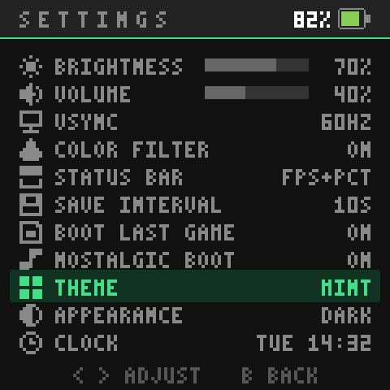
  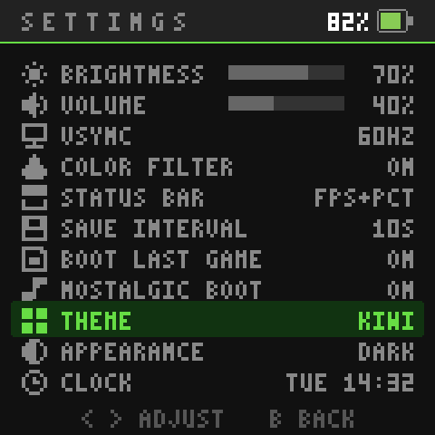
  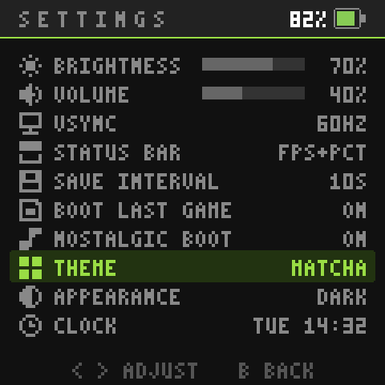
  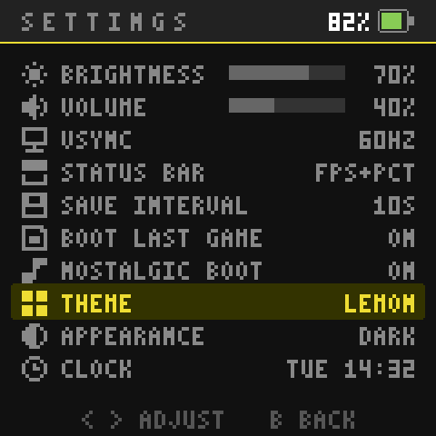
  
  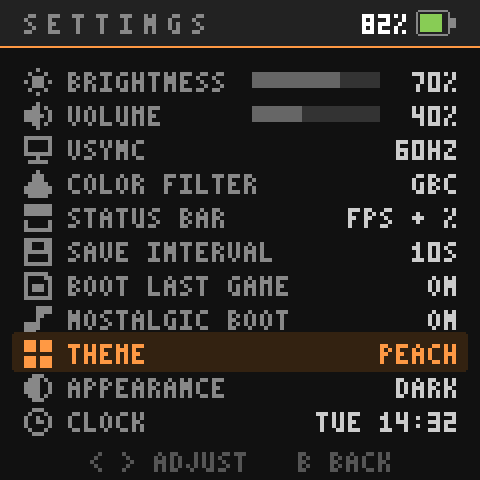
  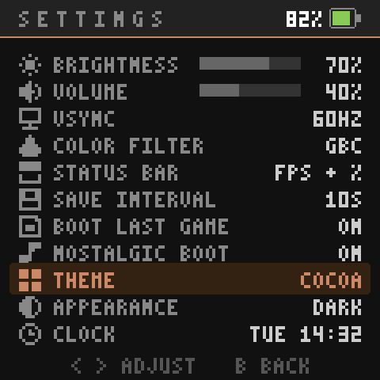
  <br>
  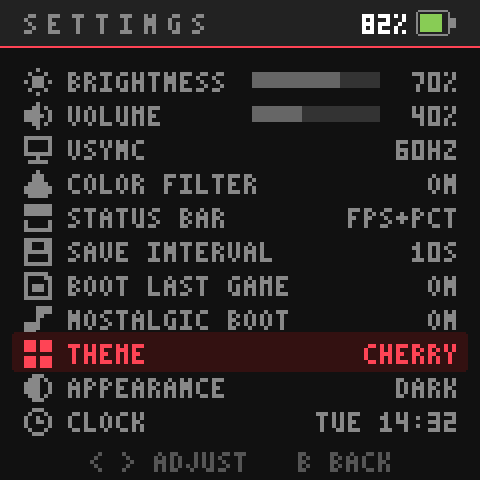
  
  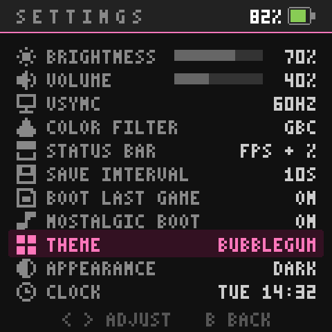
  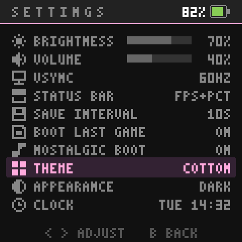
  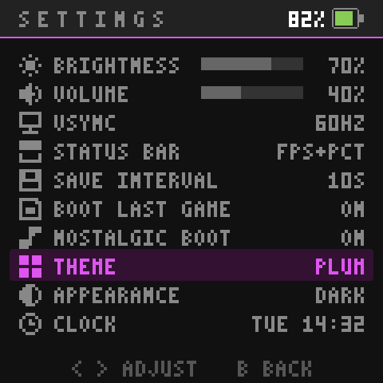
  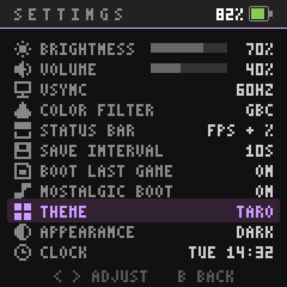
  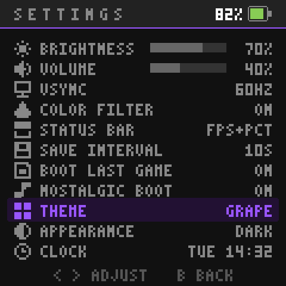
  <br>
  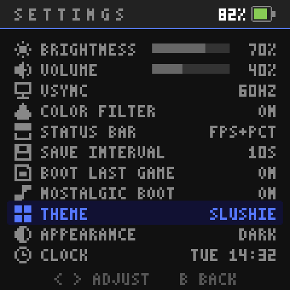
  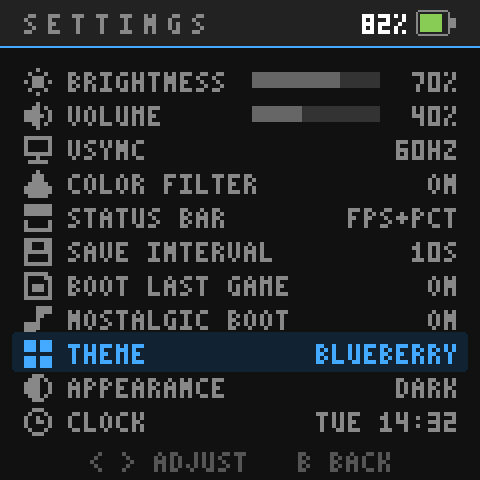
  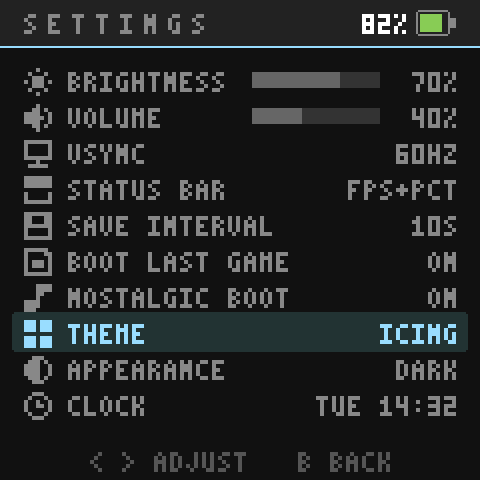
  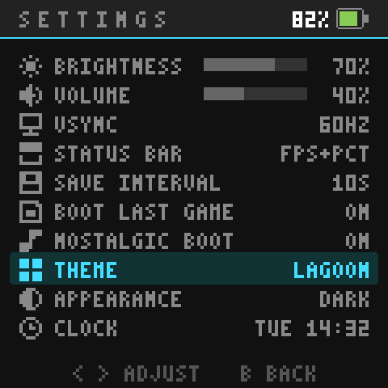
  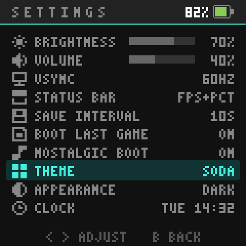
  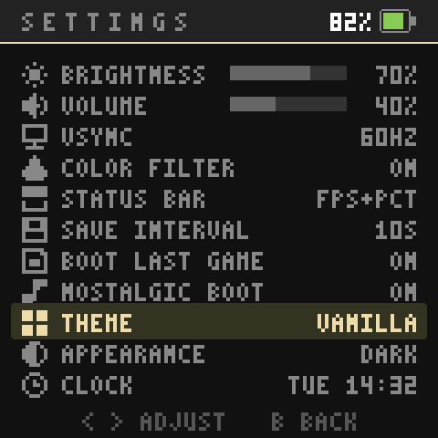
  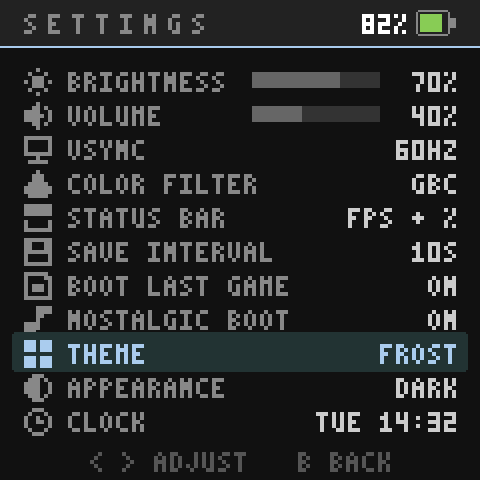
</p>

APPEARANCE switches the neutral ramp between dark and light without touching
the chosen accent, so any theme works either way:

<p align="center">
  
  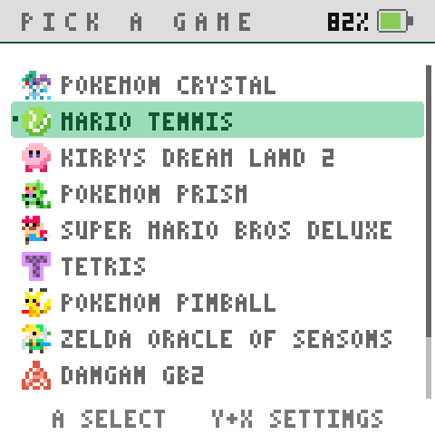
  
  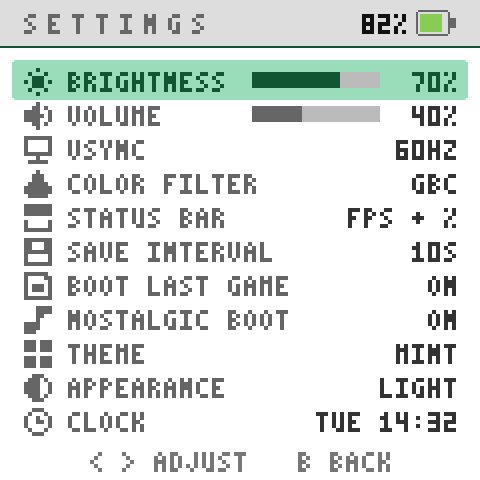
</p>

The MBC3 real-time clock gets its own screen off the settings list: an analog
face over a segmented DAY/HR/MIN readout with small seconds beside it, `<` `>`
to pick a field and up/down
to spin it. The STATUS BAR setting can drop the header entirely for a
letterboxed fullscreen canvas -- or, in FS BATTERY, trade it for a 2px battery
meter running the full width of the screen's top edge:

<p align="center">
  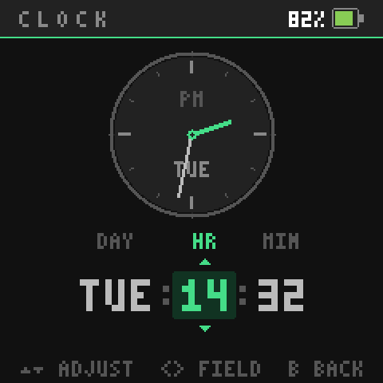
  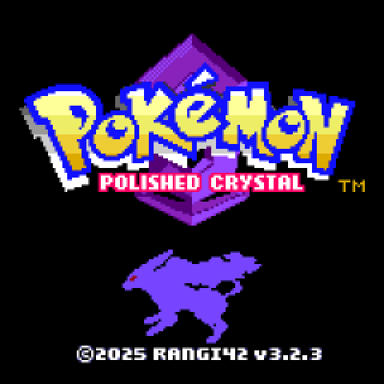
  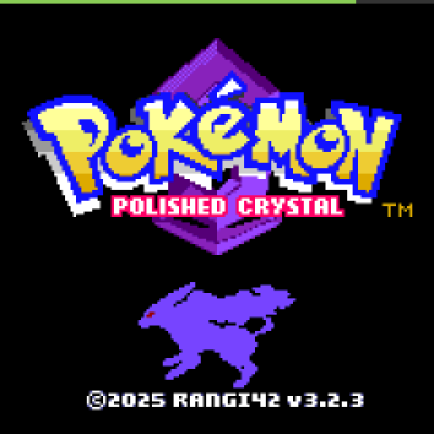
</p>

> Screenshots are generated on the host, not photographed off the panel:
> `tools/make_screenshots.sh` compiles the real drawing code out of `main.cpp`
> and runs the real emulator core, so what you see above is pixel-exact to the
> device (see [Repo layout](#repo-layout)).

## Customizing names, order, and save slots (`assets/roms.json`)

By default games appear in alphabetical filename order, named after the file
(`super_mario_bros_deluxe.gbc` → `SUPER MARIO BROS DELUXE`). To override,
create `assets/roms.json` (it is gitignored, like the ROMs):

```json
{
  "roms": [
    { "file": "polishedcrystal.gbc",  "name": "POKEMON CRYSTAL", "slot": 0 },
    { "file": "chromatic_tetris.gbc", "name": "CHROMATIC TETRIS" },
    { "file": "some_other_game.gb" }
  ]
}
```

`name` and `slot` are optional (omit or set to `null`). The array sets the
menu order; unlisted files are appended alphabetically. Names may use `A-Z`,
`0-9`, and spaces (the menu font has nothing else). Entries for files no
longer in `assets/` are skipped with a warning, and their pinned slots stay
reserved — so you can remove a game without touching the manifest, and
re-adding the file later reattaches its old save.

**Save slots** matter once you have saves you care about: each game's save
lives in the flash region chosen by its slot number (0–13), which defaults to
its position in the list. Adding, removing, or renaming ROM files can
therefore re-shuffle slots and detach games from their existing saves (the
save data itself is untouched — saves live outside the firmware and survive
reflashing). If you change the ROM list on a device with saves you want to
keep, pin each existing game's slot in `roms.json` first — the build log
prints every game's current slot.

## Per-game menu art (`assets/icons.png`)

Games show a generic cartridge glyph in the boot menu, tinted by the `color`
above. Drop an `assets/icons.png` next to your ROMs to replace it with your own
8×8 pixel art: **8px wide, one 8×8 tile per save slot stacked top to bottom**,
so a full sheet covering all 14 slots is 8×112. Save it as a non-interlaced,
8-bit PNG; transparent pixels let the row highlight show through, and the menu
draws each tile at 2× (16×16 on screen).

Tiles are keyed by **save slot**, not menu position — the same number the build
log prints — so an icon stays with its game when the menu order changes, just
like its save does. Slots you leave blank (or past the end of a shorter sheet)
fall back to the cartridge glyph, and with no `icons.png` at all nothing
changes. The sheet is gitignored like the ROMs and `roms.json`.

## Repo layout

- `main.cpp` — emulator frontend: dual-core render/audio offload, menus,
  per-game boot
- `core/walnut_cgb.h` — the CPU/PPU emulator core (heavily modified fork)
- `save_storage.*` — incremental, torn-write-safe flash save + settings + RTC
  persistence
- `picosystem/` — vendored, narrowed PicoSystem SDK fork (this project owns
  `main()` and the framebuffer)
- `tools/gen_rom_data.py` — build-time ROM catalog generator (run by CMake)
- `tools/`, `host_test/` — host-side UI render harness and emulator tests
  (`tools/make_screenshots.sh` regenerates `screenshots/`: `grab_frame.c` boots
  a ROM in the core to capture a game frame, `render_menus.cpp` compiles the
  UI code out of `main.cpp` and draws every menu screen around it)
